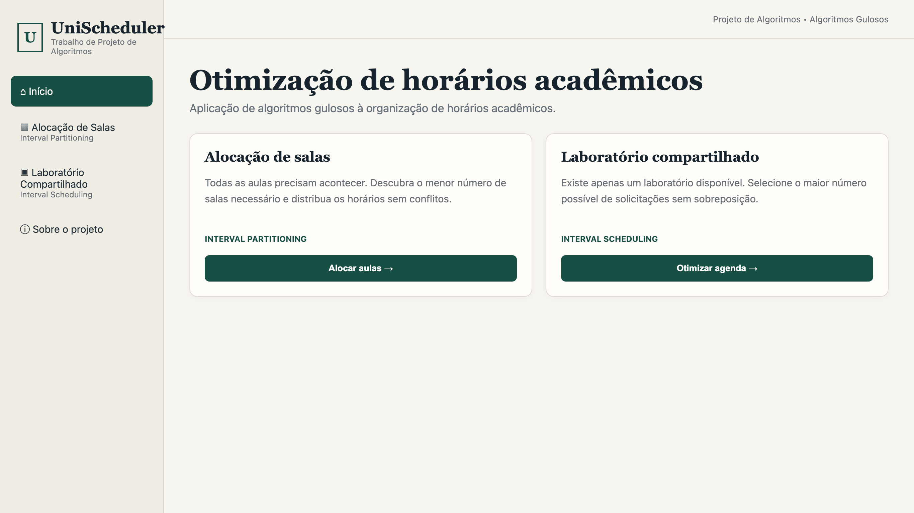
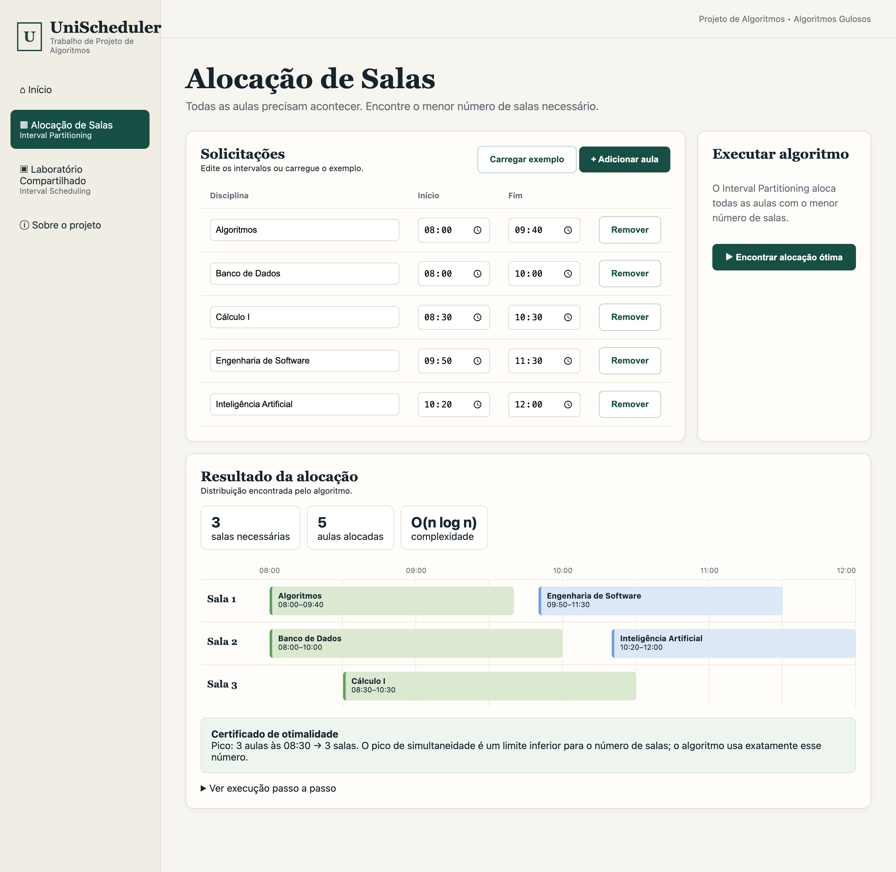
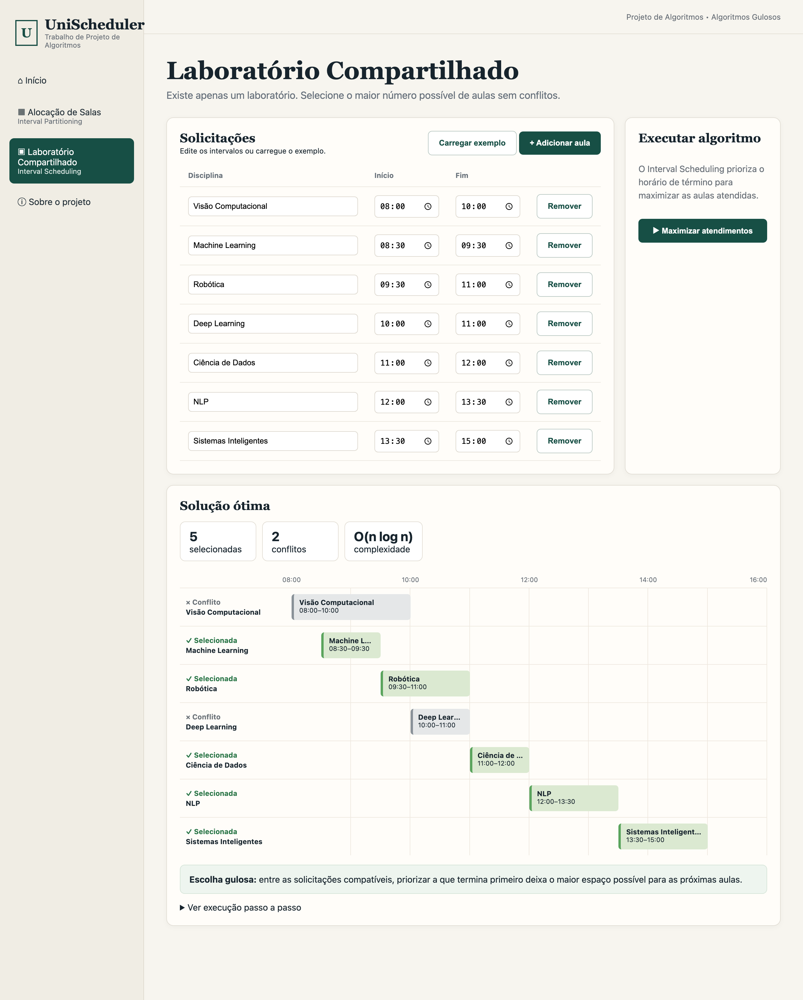

🇧🇷 **Português** | 🇺🇸 [English](README-eng.md)

<h1>UniScheduler - Alocação de Salas e Agenda de Laboratório com Algoritmos Gulosos</h1>

## Vídeo de demonstração

▶ [Assista à demonstração do UniScheduler no YouTube](https://youtu.be/ERl4qzb7DY4?is=OCpVJoPbs3ISFI4F)

<p align="center">
  <br><br>
  <br><br>
  
</p>

---

## Problema real

Toda universidade enfrenta, no começo do semestre, dois problemas de horário que parecem iguais,
mas têm objetivos opostos. No primeiro, **todas as aulas precisam acontecer**, e a coordenação
quer saber o **menor número de salas** que comporta a grade sem nenhum choque de horário. No
segundo, existe **um único laboratório** e muitas turmas pedindo para usá-lo. Nem todas cabem, e o
objetivo é atender o **maior número possível de solicitações** sem sobreposição.

Os dois partem do mesmo dado (aulas com horário de início e fim) e são resolvidos por
**algoritmos gulosos** clássicos, que tomam a melhor decisão local e provam que ela leva ao ótimo
global:

| Problema | Algoritmo | Escolha gulosa |
| --- | --- | --- |
| Menor número de salas para todas as aulas | **Interval Partitioning** | ordenar por **início** e reutilizar a sala que fica livre primeiro |
| Máximo de aulas em um único laboratório | **Interval Scheduling** | ordenar por **término** e aceitar a próxima aula compatível |

---

## Modelagem

### Aulas como intervalos

Cada aula é um intervalo `[início, fim)` com nome, início e fim no formato `HH:MM`. Para comparar
horários, [`mins`](js/algorithms.js#L1) converte cada horário em **minutos desde 00:00**
(`08:30 → 510`), e [`clock`](js/algorithms.js#L6) faz o caminho inverso para exibição.

### Compatibilidade

Duas aulas são **compatíveis** quando não se sobrepõem. O intervalo é fechado no início e aberto no
fim, então uma aula que termina às `10:00` e outra que começa às `10:00` **podem usar a mesma
sala**. Essa convenção é a mesma nos dois algoritmos, no certificado de otimalidade e nos testes.

### Validação

Antes de qualquer execução, [`validateItems`](js/algorithms.js#L20) confere cada linha e aponta
**qual aula** está errada e **por quê**: nome vazio, horário ausente, horário impossível (`25:00`)
ou término que não é posterior ao início. A linha inválida fica destacada na tabela e o algoritmo
não roda até a correção.

---

## Interval Partitioning

[`intervalPartitioning`](js/algorithms.js#L130). Aloca **todas** as aulas usando o **menor número
de salas**.

1. Ordena as aulas por horário de **início** (empate: término mais cedo primeiro).
2. Para cada aula, olha a sala que **fica livre primeiro**.
3. Se essa sala já está livre no início da aula, a aula entra nela. Se não, nenhuma outra está
   livre, e o algoritmo **abre uma sala nova**.

### Min-heap de salas

Para achar em `O(log k)` a sala que fica livre primeiro, as salas ficam em uma
[`MinHeap`](js/algorithms.js#L45) (heap binária implementada no projeto), ordenada pelo término
da última aula de cada sala.

```
Invariante: a heap tem exatamente uma entrada por sala,
            com a chave = término da última aula alocada nela.
→ a raiz é sempre a sala que fica livre primeiro.
→ se nem a raiz está livre, nenhuma sala está.
```

### Por que é ótimo

Quando o algoritmo abre a sala `k`, todas as `k - 1` salas existentes estão ocupadas no início da
aula atual. Como as aulas foram processadas por ordem de início, isso significa que há **`k` aulas
acontecendo ao mesmo tempo** naquele instante. Nenhuma solução válida consegue usar menos de `k`
salas, porque essas `k` aulas precisam estar em salas diferentes. Logo, o número de salas usado é
igual à **profundidade** (o pico de aulas simultâneas), que é o limite inferior.

### Certificado de otimalidade

A interface não pede para acreditar na prova: [`peakConcurrency`](js/algorithms.js#L169) calcula a
profundidade por uma **varredura independente** (sweep line). Cada aula vira dois eventos (`+1` no
início e `-1` no fim), ordenados por horário, com os términos antes dos inícios no mesmo minuto.
O maior valor acumulado é o pico, mostrado na tela como, por exemplo,
`Pico: 3 aulas às 08:30 → 3 salas`.

**Complexidade:** `O(n log n)`. A ordenação custa `O(n log n)`, e cada aula faz no máximo uma
remoção e uma inserção na heap, em `O(log k)`, com `k ≤ n`.

---

## Interval Scheduling

[`intervalScheduling`](js/algorithms.js#L103). Com **um único laboratório**, seleciona o **maior
número possível** de aulas sem sobreposição.

1. Ordena as solicitações por horário de **término** (empate: início mais cedo primeiro).
2. Percorre a lista guardando o término da última aula aceita.
3. Aceita a aula se ela começa **depois ou exatamente quando** a última aceita termina. Caso
   contrário, ela é marcada como conflito.

```
Invariante: as aulas aceitas são compatíveis entre si,
            e lastEnd é o término da última aceita.
```

### Por que é ótimo (argumento de troca)

Seja `a` a aula que termina primeiro e `O` uma solução ótima qualquer. Se `O` não contém `a`,
troque a primeira aula de `O` por `a`: como `a` termina antes ou junto dela, ela não conflita com
nenhuma das outras, e a solução continua do mesmo tamanho. Então **existe uma solução ótima que
começa por `a`**. Aplicando o mesmo argumento ao que sobra depois de `a`, por indução, a escolha
gulosa produz uma solução ótima.

Terminar primeiro é o critério certo porque deixa o **maior tempo livre** para as próximas
solicitações. Escolher a aula **mais curta** ou a que **começa primeiro** pode falhar: uma aula
longa que começa cedo bloqueia várias aulas curtas.

**Complexidade:** `O(n log n)` para ordenar e `O(n)` para percorrer.

---

## Visualização

[`js/app.js`](js/app.js) transforma o resultado de cada algoritmo em algo que dá para explicar em
uma apresentação:

| Recurso | Partitioning | Scheduling |
| --- | --- | --- |
| **Linha do tempo** | uma faixa por sala, com as aulas alocadas | uma faixa por aula, selecionadas em verde e conflitos em cinza |
| **Métricas** | salas necessárias, aulas alocadas, complexidade | selecionadas, conflitos, complexidade |
| **Prova na tela** | certificado de pico de simultaneidade | explicação da escolha gulosa |
| **Passo a passo** | sala criada ou reutilizada em cada aula | aula aceita ou rejeitada em cada passo |

A escala da linha do tempo se ajusta aos horários informados ([`timelineScale`](js/app.js#L217)),
então aulas à noite ou bem cedo aparecem inteiras. Os nomes das disciplinas passam por
[`escapeHtml`](js/app.js#L97) antes de entrar na página, e as aulas editadas ficam salvas no
navegador (`localStorage`).

---

## Estrutura do projeto

```
unischeduler/
├── index.html                    # Estrutura da página e navegação
├── css/
│   └── style.css                 # Identidade visual e layout responsivo
├── js/
│   ├── algorithms.js             # MinHeap, Partitioning, Scheduling, certificado e validação
│   └── app.js                    # Telas, edição, linha do tempo e passo a passo
├── tests/
│   ├── algorithms.test.js        # Suíte Node: casos de borda e busca exaustiva
│   └── test.html                 # Testes rápidos no navegador
└── img/                          # Capturas de tela usadas neste README
```

> **Nota de projeto:** [`js/algorithms.js`](js/algorithms.js) não depende do navegador. As mesmas
> funções rodam na interface e na suíte de testes do Node, então o que é testado é exatamente o que
> a tela executa.

---

## Cenários de demonstração

O botão **Carregar exemplo** de cada tela traz um caso pensado para a apresentação:

| Tela | Entrada | Resultado |
| --- | --- | --- |
| **Alocação de Salas** | 5 aulas entre 08:00 e 12:00 | **3 salas**. Pico de 3 aulas às 08:30 (Algoritmos, Banco de Dados e Cálculo I). Engenharia de Software e Inteligência Artificial reaproveitam salas liberadas |
| **Laboratório Compartilhado** | 7 solicitações entre 08:00 e 15:00 | **5 selecionadas** e **2 conflitos**. Visão Computacional (08:00–10:00) é rejeitada, mesmo começando primeiro, porque Machine Learning termina antes |

---

## Como executar

Não há dependências nem build: o projeto é HTML, CSS e JavaScript puro.

**Opção 1:** abra o `index.html` direto no navegador.

**Opção 2:** sirva a pasta localmente:

```bash
python3 -m http.server 8000
```

Acesse [http://localhost:8000](http://localhost:8000).

**Opção 3 (VS Code):** instale a extensão **Live Server**, clique com o botão direito em
`index.html` e escolha **Open with Live Server**.

## Como executar testes

Pré-requisito: **Node.js 18+**.

```bash
node --test tests/algorithms.test.js
```

São 5 testes cobrindo casos de borda (lista vazia, aula única, aulas idênticas, horários
adjacentes), validação de entrada, o certificado de pico e uma comparação dos dois algoritmos com
**busca exaustiva** em 100 entradas aleatórias determinísticas. Os testes rápidos também podem ser
abertos no navegador em `tests/test.html`.

---

## Colaboradores

| [Camila Cavalcante](https://github.com/CamilaSilvaC) | [Luísa Ferreira](https://github.com/luisa12ll) |
| :---: | :---: |
|  |  |
